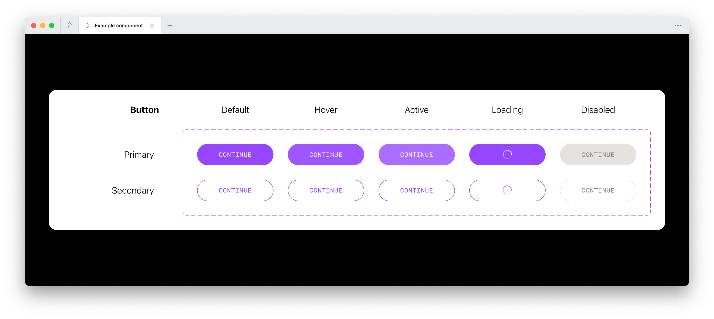

# Polymorphic components and you

Reusable components are critical to any well-developed React application. While many approaches exist for building such components, polymorphic components are a particularly useful pattern. These components are designed to render different underlying HTML based on the provided props.

To demonstrate why this is so essential, allow me to share a scenario you’re likely to encounter in the course of React-driven web development. Let’s say that yours designers have provided specs for a button in Figma, like so:



“No problem,” you say, “Seems simple enough!” And then you go ahead and build your `Button` component, like so:

```jsx
// In this example, let’s say that `buttonStyles` is a reference to a className
// that provides styles for your button.
//
// For simplicity, I’m omitting handling props for UI variants and states, so
// we can focus on the topic at hand.

function Button({className, ...otherProps }) {
  return <button className={cx(buttonStyles, className)} {...otherProps} />;
}
```

All is well and good — you have a `Button` component that matches your designer’s UI specs.

… But wait! Suddenly you’ve been tasked with implementing a feature that involves having a button navigate the user to a new page when clicked. Your designers have used that `Button` as a link.

But it’s not a link. For one thing, it certainly _looks_ like a button. And the component we’ve built to represent this UI is called a `Button`. And that component renders a `<button>` element … But! Despite all of this, a clickable element that takes you to a new page is a link, not a button.

HTML provides a number of built-in elements, and these elements provide a number of built-in behaviors and conveniences that we should strive to leverage when possible. It’s not the responsibility of your designers to understand this. As a developer, you should be able to work around this and use the semantically and functionally correct element.

But how do we approach this? We have a `Button` component, and it renders a `<button>` DOM node already. Here are some solutions I’ve encountered:

1. ## Using functions provided by router libraries

   It’s common to use frameworks that include ways of programmatically navigating between routes, often in the form of something like a `useRouter` hook. Maybe this is your solution? You can avoid using an `<a>` tag entirely and maintain the semantics of your `Button` component, just by using an `onClick` and avoiding links entirely!

   In NextJS, this looks something like so:

   ```jsx
   import { useRouter } from "next/navigation"

   function DashboardLink() {
     const { push } = useRouter();

     return (
       <Button onClick={() => push("/dashboard")}>
         Dashboard
       </Button>
     )
   }
   ```

   I hate to be the bearer of bad news, but this is not an ideal solution. Even NextJS’s own docs [warn against this approach](https://nextjs.org/docs/app/api-reference/functions/use-router), unless you have specific cause to do so.

   Why might this be? For one thing, this breaks a number of the convenient behaviors that native anchor tags provide by default. For example, this approach breaks the ability for the user to open the link in a new tab, either for later reference or multitasking. This feature would have worked by default if we were rendering an `<a>` tag.

   In NextJS (and many other libraries), a dedicated `Link` component is also provided for use, in order to provide prefetching and enable client-side navigation between routes. For the benefit of the user, we should rely on this as much as possible to avoid missing out on these built-in features.

2. ## Wrapping the component in an extra node

   We’ve established the importance of using the appropriate semantic element. With this in mind, let’s say you take another stab at implementing this design, and try something like this:

   ```jsx
   function DashboardLink() {
     return (
       <a href="/dashboard">
         <Button>
           Dashboard
         </Button>
       </a>
     )
   }
   ```

   This may work, but that’s because browsers are _very_ lenient about malformed HTML, and will attempt to correct it and let the user see _something_. Technically, this is not valid HTML according to [W3C specs](https://html.spec.whatwg.org/multipage/text-level-semantics.html#the-a-element), which specifically disallows interactive content (which a `<button>` qualifies as) from being a descendant of an `<a>` tag.

   The HTML police (_probably_) won’t be coming around to arrest you if you do this, but this still negatively impacts the user experience. For example, keyboard navigation and managing browser focus are both very important considerations for any user who is not using a pointer device for their primary input. If I’m using a keyboard to tab through focusable elements, or navigating the page with the assistance of a screenreader, I now have two elements to navigate through - one of which is entirely redundant and has no obvious functionality on its own.

   This approach also introduces the potential for a category of UI bugs that aren’t possible otherwise. Browsers provide their own user-agent styles to `<a>` tags, and perhaps you haven’t included a CSS reset in your project. Perhaps your team has added their own global styles to anchor tags. This means that now, because the Button is a descendant of the `<a>`, the `Button` will also inherit the styles that have been applied to the link. This can result in issues like so:

   

   That isn’t great. It would be much better if we could _only_ render the elements that are semantically required, while preserving the styles attached to our already-defined component.

3. ## Adding additional props to control rendered output

   Maybe we can do this by adding an `isLink` boolean prop to the `Button` component, and toggling the rendered output based on that? For example, we could update our component definition like so:

   ```jsx
   function Button(({className, isLink, ...otherProps }) {
     const RenderedElement = isLink ? "a" : "button";

     return <RenderedElement className={cx(buttonStyles, className)} {...otherProps} />;
   };
   ```

   “Great,” you think to yourself, “Now I can finally get my ‘Add Button component’ pull request approved!”

   Not so fast, though. While it’s true that we’re rendering the appropriate semantic element, there are many drawbacks to this approach.

   A lot of React development is done with Typescript, so how do we handle prop definitions? How do we handle adding an `href` prop that applies only when `isLink` is true? What about other HTML attributes specific to the anchor tag, like `target`, or `referrerpolicy`? Or vice-versa: what about other button element attributes like `type` or `value`? Or what if we want to support both native anchor tags, as well as `Link` components from the routing libraries we talked about earlier?

   You could probably answer these questions by adding increasingly more elaborate prop definitions, and greatly increasing the size of the prop interface itself, but this should signal to you that this is not really a sustainable option, and results in component definitions that are increasingly more complex and are juggling a lot more functionality than is reasonable.

   Okay, so now what?

## Enter polymorphic components

Polymorphic components are a pattern designed to address exactly this issue. If you’ve spent much time working with React, you might have encountered this pattern before. If you’ve used CSS-in-JS libraries like [styled-components](https://styled-components.com/), or popular component libraries such as [Material UI](https://mui.com/material-ui/getting-started/), you may have seen the “as” prop. If that isn’t ringing any bells, I’m referring to a pattern like so:

```jsx
<Button as="a" href="/dashboard">Dashboard</Button>
```

Styled-components [defines this feature](https://styled-components.com/docs/api#as-polymorphic-prop) like so:

> If you want to keep all the styling you’ve applied to a component but just switch out what’s being ultimately rendered (be it a different HTML tag or a different custom component), you can use the `as` prop to do this at runtime.

This sounds like exactly what we’re looking for, doesn’t it? This is a very powerful concept that facilitates components that are more:

- Reusable: Allows for reuse of styles (and logic) within a component across different contexts
- Consistent: Helps to ensure a uniform appearance in our UI, even when the underlying HTML nodes may vary
- Flexible: Accomplishes all of the above with a minimum amount of overhead or redundant code.

If you’re not using a component library that provides functionality like this, it’s actually relatively easy to create. Let’s revisit our earlier `Button` component, rewritten with support for an `as` prop:

```jsx
function Button({as, className, ...otherProps }) {
  // We rename the `as` prop to `Component`, because all React custom components
  // must start with a capital letter.
  //
  // You may choose another name, but without doing this, React would assume we
  // were referring to a native HTML element and render `<as>` into the DOM.
  const Component = as || "button";

  return <Component className={cx(buttonStyles, className)} {...otherProps} />;
};
```

This implementation works, but lacks proper type annotation. This is a problem because it means that our implementation won’t stop me from passing in unsupported props like an `href` prop on an `h1`, as in `<Text as="h1" href="https://www.metalab.com">`.

The solution lies with typescript generics. When defining our Button props, we can define them as a new type that provides a generic value for the as prop, like so:

```ts
type ButtonProps<C extends React.ElementType> = {
  as?: C;
  // …other Button-specific props can follow, here.
} & React.ComponentPropsWithoutRef<C>;
```

This is the basic solution, but there are additional details to consider. For example, `ref` support and other custom props you may want to add to your component. To save you some time, there are a number of packages that provide types for this use case, such as [react-polymorphed](https://github.com/nasheomirro/react-polymorphed), and I’d recommend using those rather than manually re-creating proper type annotations for your polymorphic components.

What is especially fantastic about this is how this allows Typescript to provide automatic type-checking for component props based on the value of the `as` prop, and provide appropriate suggestions, like so:


## Composing polymorphically

The early examples in this article that examined the drawbacks of non-polymorphic UI components focused on rendering semantic HTML. But there are further benefits to this pattern: they allow you to rapidly compose new components that extend from your primitive UI components.

Let’s say, for example, you have an `<Input>` component that renders a text input with preset styles for your web app, and are now tasked with adding a new feature: a variation of this input that looks identical, but masks the input value. Masking the input value, in this case, means rendering the user’s input value in a preset format, like a date or phone-number, like so:


This is a common pattern, so it’s likely that we’ll reach for pre-existing solutions. For the following example, I chose the [react-input-mask](https://www.npmjs.com/package/react-input-mask) package, which works for our example because it’s component-based.

If we had built our `Input` non-polymorphically, there’s a lot of additional overhead. Because `InputMask` is already defined as it’s own component, how do we share our base UI styles with it? Do we copy our many tailwind classes into a new `MaskedInput` component? What happens when we want to update the input styles; how do we keep them in sync?

These questions are answered easily when you have the ability to compose polymorphically, because we can simply write:

```jsx
import InputMask from "react-input-mask";
import {Input} from "./components";

// For the above imports, let’s say we have our own primitive UI input component
// with `as` prop support being imported from our local `./components` folder.
// Later, in our JSX, we can write…

<Input as={InputMask} mask="YYYY-MM-DD" {...otherProps} />
```

## Drawbacks with the `as` prop

The `as` prop is not the only way to implement polymorphic components, and there are some potential drawbacks to that approach.It can be tricky to resolve conflicting prop interfaces between the base polymorphic component the component passed via the `as` prop. Allow me to illustrate via a contrived example:

As an example, imagine we have a polymorphic `Card` component, for rendering a styled container for content. Our designers have also provided various appearances for `Card`s, which we’ve added support for via a `type` prop:

```jsx
  <Card type="primary" /> // ← Renders a Card with styles for the "primary" appearance
  <Card type="alternate" /> // ← Renders a Card with the styles for the "alternate" appearance
```

Now imagine the `Card` needs to be clickable. The `Card` is polymorphic, so let’s use the `as` prop:

```jsx
  <Card as="button" type="alternate" />
```

… But what happens if this also needs to be nested in a `<form>`? This `Card` shouldn’t submit the form, so we need to add `type="button"` to prevent the button rendered by the `Card` from triggering the submit action. This poses a problem: how do we pass `type="button"` to the `Card`, when `type` is already used for different purposes in the `Card`? One workaround is to introduce an intermediary component function that handles this:

```jsx
  <Card disabled as={(props) => <button {...props} type="button" />} />
```

Treating `as` as a render prop works, but isn’t ideal. We’re effectively defining a new functional component here, that will be re-created on every render. We can work around this by memoizing the function, or moving it outside of the render function, but this approach can become cumbersome if you find yourself requiring this regularly.

## Rendering with `asChild`

As an alternative, you may consider the `asChild` prop, which is the approach popularized by my personal favorite React component library, [Radix UI](https://www.radix-ui.com/primitives). Unlike the `as` prop, where the component to be rendered is passed as a prop value on the original component,, `asChild` will render the root child passed to the component _as_ the component. Let’s revisit the original example:

```jsx
<Button asChild>
  <a href="/dashboard">Dashboard</a>
</Button>
```

Here, the `Button` component has been provided both an `asChild` prop, and an `<a>` tag as the root child. In this implementation, the `Button` will _clone_ the root node, and add the additional props controlled by the `Button` component onto the root child. A simplified custom implementation may look something like:

```jsx
function Button({asChild, className, children, ...otherProps }) {
  const isPolymorphed = asChild && isValidElement(children);

  return isPolymorphed
    ? cloneElement(children, {
        ...otherProps,
        ...children.props,
        className: cx(buttonStyles, className, children.props.className),
      })
    : <button className={cx(buttonStyles, className)} {...otherProps}>{children}</button>
});
```

This approach handily avoids the problem of prop collisions by favoring a more compositional approach, compared to the more “explicit configuration via props” that `as` allows. The Radix component library publishes a [`Slot` component](https://www.radix-ui.com/primitives/docs/overview/introduction) that you can use to introduce this behavior in any of your custom components as well!

## `asChild` prop caveats

We aren’t done yet, though — there are tradeoffs to be aware of.

A component that implements polymorphism via `asChild` forwards props without regard for whether the child element is designed to accept them. In most cases, this may be just a `className`, which can be easy to account for. However, some polymorphic components may be designed to provide specific behaviors, such as Radix UI’s `TooltipTrigger`, and will also provide various `aria` attributes for accessibility purposes.

Because the root polymorphic component and its child are declared separately as two distinct JSX nodes, the Typescript compiler cannot guarantee compatibility, and you must consider the private implementation details of the “parent” component, in order to prevent the rendering of invalid HTML.

As a simple example, consider the “button-as-link” scenario we’ve been revisiting, and suppose we want to disable the `Button`. A naive approach using `asChild` might look like this:

```jsx
<Button asChild disabled>
  <a href="/dashboard">Dashboard</a>
</Button>
```

Unlike the `as` prop approach, Typescript will not be able to alert you that the disabled prop is not compatible with an `<a>` element, so the resulting HTML would look like the following:

```html
<a href="/dashboard" disabled>Dashboard</a>
```

… Which is invalid HTML and would not work to disable the link in question.

## What other approaches are there?

[Base UI](https://base-ui.com/react/overview/quick-start) is an up-and-coming component library made by many of the previous maintainers of Radix. Interestingly, they’ve opted not to continue using the `asChild` pattern, in favor of a `render` prop. In practice, it looks something like this:

```jsx
  <Button render={<a href="/dashboard" />}>
    Dashboard
  </Button>
```

How is this `render` prop different? In usage, this feels like it falls somewhere between the `as` and `asChild` approaches. Like with `asChild`, this approach clones the declared component and forwards the props passed to the root element. Unlike `asChild`, this includes the polymorphic component’s children, a behavior similar to the `as` prop approach. From a developer experience perspective, this has the benefit of helping to reduce the level of required nesting in dense JSX trees where `asChild` is used.

Another feature of the `as` prop pattern that this reintroduces is the ability to treat the `render` prop _as a “render prop”_. This means we can also pass a function directly as the `render` prop value, just like we could with the `as` prop, earlier:

```jsx
  <Button
    disabled
    render={({disabled, ...restProps}) => <a {...restProps} href={disabled ? "" : "/dashboard"} />}
  />
```

[Base UI’s docs](https://base-ui.com/react/handbook/composition) include additional instructions for `render` prop-based component composition.

While [React’s own docs](https://react.dev/reference/react/cloneElement#alternatives) document the render prop pattern as an alternative to `cloneElement` (which, as we’ve seen, is the API the `asChild` pattern uses), it is also positioned as an uncommon pattern that has largely been supplanted by custom hooks. While this may be true when considering render props as a solution for sharing internal component state, this is still a useful approach for composing UI components.

Like Radix before it, Base UI also offers a solution for implementing this pattern in your own components, this time using a [hook-based approach, with `useRender`](https://base-ui.com/react/utils/use-render).

## Wrapping up

So which approach is best? The answer, as with most things, is that it depends. Polymorphic components are a powerful tool, but the patterns used to implement them are best understood as tools in your belt, and understanding which is most appropriate is a question only you can answer for your specific situation.

Despite my own affinity for _terseness_ of the `as` prop compared to the additional JSX and nesting of `asChild`, dynamically deriving prop types for a component whose interface can change completely based on the `as` prop value can be frustrating to manage.

While the render prop pattern appears the most flexible, many popular solutions for React component development (such as [shadcn/ui](https://ui.shadcn.com/)) use Radix and the much more established `asChild` pattern. If you’re in the midst of a project that is already using an established solution for this problem, it would not make sense to start building components using a different pattern.

What I hope you take away from this article is not an advocacy for a specific implementation, but an understanding of the value of polymorphic components, and how they allow you to streamline the development process by writing more adaptable and maintainable components.
