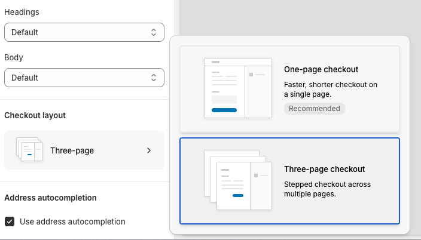
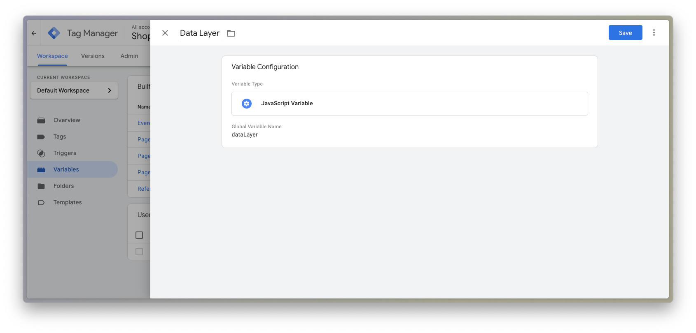

# Integrating Google Tag Manager and Shopify’s Custom Pixels

Recently, we encountered an issue while working on a [Shopify Hydrogen app](https://hydrogen.shopify.dev/) for a client. For this project, we were tracking analytics with Google Analytics, which was integrated into our application via Google Tag Manager. Just as we were nearing the end of the project, they approached us with an issue: they were not seeing any events related to the checkout experience being logged in the analytics control panel!

In-depth knowledge of traffic analytics dashboards is an entirely different skill set than what I _typically_ deal with day-to-day as a software engineer, and most of what I’m going to cover is specifically related to settings in the Google Tag Manager and Shopify admin panels.

We knew we had the standard Google Tag Manager script snippet that Google provides integrated into the codebase for our Hydrogen app, and were definitely emitting custom events where necessary, so what was different about the checkout experience? Our investigation exposed a key incompatibility between Shopify and Google Tag Manager’s Preview Mode, and yielded a work around for logging events, which was essential for debugging our Tags and associated Triggers in Google Tag Manager. If you’re having trouble integrating your analytics provider with Shopify’s checkout experience, read on to see how we solved our problem.

## Testing with Google Tag Manager’s Preview Mode

One of the key features for testing and debugging your Google Tag Manager setup is the [Preview Mode](https://support.google.com/tagmanager/answer/6107056?hl=en). To use Preview Mode:

1. In your Google Tag Manager account, press the **Preview** button.
2. In the resulting dialog, enter the URL for the domain you want to test.
   - The URL you provide must include the Google Tag Manager script snippet for the correct container ID.
3. Press the **Connect** button. The URL you entered will open in a new tab.
   - For convenience, you may want to rearrange your windows so both tabs are side-by-side!


When you provide a URL that includes the Google Tag Manager script snippet for the correct container ID, this will enter the **Preview Mode**, which will allow you to interact with your page while recording a list of all of the events received by Google Tag Manager.

If you’re developing a Hydrogen application that uses Shopify’s Checkout experience, however, you’ll likely encounter an error with the Preview mode once you proceed to checkout:


As you can see, Google Tag Manager is no longer able to track events: we’ve navigated to a new document, which is rendered in a disabled state, and it reports that the domain for this page is not enabled for debugging. If you click for additional details, Tag Manager will warn you that the script snippet for the container could not found. Well, this _seems_ like the source of our problem; so what’s going on here? The checkout process is a key experience in e-commerce applications, and gaining insight with analytics here is important.

This is because the checkout page is managed by Shopify themselves. If we were working on a local development environment, we might notice that we are now on a Shopify-owned domain. Even in a deployed environment with a custom domain configured, this is still a new HTML document that is separate from our Hydrogen codebase. Which means that the Google Tag Manager script snippet we’ve added elsewhere isn’t present here. So what can we do?

## Shopify’s Custom Pixels

To attempt to address this issue, Shopify has provided a feature they call “Custom Pixels”. You may find that this is alternatively referred to as “Customer Events”. In any case, we can use this to integrate Google Tag Manager, so let’s create a new Custom Pixel now:

1. Navigate to the Settings Page for your Shopify Store, and select [**Customer Events**](https://admin.shopify.com/settings/customer_events).
2. Press **Add Custom Pixel**.
3. In the resulting dialog, add a name for the custom pixel. Because we are integrating Google Tag Manager, let’s call it `"Google Tag Manager"`.

A “Custom Pixel” is effectively just a code snippet that Shopify will allow you to include on the checkout page. In this case, we can provide the standard Google Tag Manager script snippet that Google will provide you with — you can copy it from Google Tag Manager and paste it into the text box provided. An important detail to remember here, is that Shopify intends you to write JavaScript directly in this input, so we must make sure to omit the `<script>` HTML nodes that Google adds by default. After adding, it should look something like:


You may have already added this, and have run into the next issue: despite adding this Custom Pixel, Google Tag Manager’s Preview mode is _still_ broken, and _still_ won’t provide a log of any events on the checkout page.

So despite the Custom Pixel, why aren’t we capturing events in Preview Mode? This is because, as Shopify warns us, pixel access is sandboxed for security and stability. This results in a _lot_ of [restrictions](https://help.shopify.com/en/manual/promoting-marketing/pixels/overview#pixels-sandbox-environment) on what you can do with the code within a Custom Pixel.

To better demonstrate this, and explain what sandboxing actually means in this case, we can inspect the DOM for the checkout page directly. If you drill down far enough, you can find a visually-hidden `<div>` element, which itself contains an `<iframe>`, and on inspecting the content of that iFrame, we can actually see the Google Tag Manager script with our container ID. So the Custom Pixel is definitely loading the Google Tag Manager library, but because it exists in a separate context inside this deeply nested iFrame, it can’t connect to the Preview mode.


Because of this setup, Google Tag Manager’s preview mode will not work with Shopify’s checkout page.

Setting aside that problem for the moment, let’s also look at the flip side: Because the code snippet from our Custom Pixel is being loaded into this iFrame, there is very limited information about the parent document that we can access or respond to. The parent document is where everything that the user will interact with exists, and is the source of many events we may want to react to. How can we do that from within the sandbox?

Shopify provides a [Web Pixels API](https://shopify.dev/docs/api/web-pixels-api#custom-web-pixels) for this purpose. Using the [`analytics` interface](https://shopify.dev/docs/api/web-pixels-api/standard-api/analytics) that this makes available, we can subscribe to any of [a limited set of events](https://shopify.dev/docs/api/web-pixels-api/standard-events) that Shopify defines. In order to subscribe, we need to provide a callback function for a given event, which will make the appropriate call to our analytics library.

Here’s an example of code you might add to push events to Google Tag Manager. If you are using Google Analytics, as this example does, you may be interested in transforming the event data into a shape that matches [Google Analytics’ recommended ecommerce event structure](https://developers.google.com/analytics/devguides/collection/ga4/ecommerce?client_type=gtm). This allows Google Analytics to infer information about the events and automatically generate relevant reports.

```js
// Preemptively define dataLayer.
window.dataLayer = window.dataLayer || [];

// Initialize GTM tag. Remember to replace the GTM Container ID!
(function(w,d,s,l,i){w[l]=w[l]||[];w[l].push({"gtm.start":
new Date().getTime(),event:"gtm.js"});var f=d.getElementsByTagName(s)[0],
j=d.createElement(s),dl=l!="dataLayer"?"&l="+l:"";j.async=true;j.src=
"https://www.googletagmanager.com/gtm.js?id="+i+dl;f.parentNode.insertBefore(j,f);
})(window,document,"script","dataLayer", "GTM-XXXXXXX");

// Map event data to desired payload.
function getPayloadForEvent(name, event) {
  return {
    event: name,
    origin: "customPixel",
    ecommerce: {
      client_id: event.clientId,
      currency: event.data?.checkout?.currencyCode,
      discount: event.data?.checkout?.discountsAmount?.amount,
      id: event.id,
      items: event.data?.checkout?.lineItems?.map((lineItem) => ({
        item_category: lineItem.variant?.product?.type,
        item_id: lineItem.id,
        item_name: lineItem.title,
        price: lineItem.finalLinePrice?.amount,
        quantity: lineItem.quantity,
      })),
      order_id: event.data?.checkout?.order?.id,
      shipping: event.data?.checkout?.shippingLine?.price?.amount,
      subtotal: event.data?.checkout?.subtotalPrice?.amount,
      tax: event.data?.checkout?.totalTax?.amount,
      timestamp: event.timestamp,
      token: event.data?.checkout?.token,
      url: event.context.document.location.href,
      value: event.data?.checkout?.totalPrice?.amount,
    }
  };
}

// Subscribe to checkout events
analytics.subscribe("checkout_started", (event) => {
  const payload = getPayloadForEvent("begin_checkout", event);

  window.dataLayer.push({ ecommerce: null });
  window.dataLayer.push(payload);
});

analytics.subscribe("checkout_shipping_info_submitted", (event) => {
  const payload = getPayloadForEvent("add_shipping_info", event);

  window.dataLayer.push({ ecommerce: null });
  window.dataLayer.push(payload);
});

analytics.subscribe("payment_info_submitted", (event) => {
  const payload = getPayloadForEvent("add_payment_info", event);

  window.dataLayer.push({ ecommerce: null });
  window.dataLayer.push(payload);
});

analytics.subscribe("checkout_completed", (event) => {
  const payload = getPayloadForEvent("purchase", event);

  window.dataLayer.push({ ecommerce: null });
  window.dataLayer.push(payload);
});
```

As you can see, Shopify and Google Analytics have different expected structures and names for ecommerce events, so it’s important to map from one to the other, if we want to utilize the advantages of Google Analytic’s recommended event structure. We defined a `getPayloadForEvent` function that takes in an event, and returns a standardized object that reflects Google Analytics’ ecommerce event. We then call `analytics.subscribe` for each of the checkout events we want to capture, and pass the event and appropriate event name to that function.

After we get our payload, we push it to the `dataLayer` array that Google Tag Manager adds to the window. Note that prior to pushing a new event, we also push `{ ecommerce: null }` to clear the ecommerce object prior to pushing a new one. Clearing the object will prevent multiple ecommerce events on a page from affecting each other, and is a pattern documented in [Google Analytics’ guide for measuring ecommerce](https://developers.google.com/analytics/devguides/collection/ga4/ecommerce?client_type=gtm).

Another important detail to note is that some events, such as `"checkout_shipping_info_submitted"` and `"payment_info_submitted"` will not be emitted unless the multi-step checkout experience has been selected in Shopify. By default, Shopify now uses a “one-page" checkout experience, where inputs for all data is contained on the same page. This means the steps described by these events do not occur separately or sequentially apart from each other. If you must track these events, **and** you are comfortable with changing the Checkout UX to accommodate this, you can change this from the [Checkout Settings page](https://admin.shopify.com/store/ml-example-store/settings/checkout):



1. On [this page](https://admin.shopify.com/store/ml-example-store/settings/checkout), locate the [**Configurations** section](https://help.shopify.com/en/manual/checkout-settings/customize-checkout-configurations/index).
2. Press the **Customize** button for the configuration you want to update.
3. In the editor, scroll to the end of the **Settings** menu to locate the **Checkout Layout** option.
4. Select **Three-page checkout**.

## Debugging Google Tag Manager events on Shopify Checkout pages

Now we’re getting somewhere: we’ve integrated Google Tag Manager on the Shopify checkout page, and are recording events for each stage of the checkout experience. There’s still one problem, though: Google Tag Manager’s Preview Mode is incompatible with Shopify’s checkout page, and we still don’t have a workaround for that. We may not be able to use Preview Mode, but there are strategies we can deploy that allow us to log events for debugging purposes and feel confident that the events we emit in our Custom Pixel are making it to Google Tag Manager. This requires switching back over to Google Tag Manager and wiring up some additional tags, triggers, and variables, via their admin UI.

First, let’s create a couple variables that can be used to help identify events fired by our Custom Pixel:

1. In the **User-Defined Variables** section, create a new variable.
2. For the **Variable Type**, select _Data Layer Variable_.
3. For the **Data Layer Variable Name**, enter _`origin`_.

The resulting variable should look something like:


If we refer back to the code for our Custom Pixel, we can see that in every event, we’re including a property called `origin` that includes the value `"customPixel"`, like so:

```js
    event: name,
    origin: "customPixel", // ← This is the value our new GTM Variable will reference.
    ecommerce: {
      // … The rest of event payload
    },
```

This variable is configured to reference that key on the dataLayer, and we can use it to identify Custom Pixel events.

Next, lets create a second variable, that allows us to get the value of the dataLayer in its entirety:

1. In the **User-Defined Variables** section, create a new variable.
2. For the **Variable Type**, select _JavaScript Variable_.
3. For the **Global Variable Name**, enter _`dataLayer`_.

Once configured, this variable should look something like this:



Next, we will want to create a new Trigger. Triggers are conditions that are added to Tags, and when the conditions for the Trigger are detected, the Tag will be fired. Let’s wire up our Trigger like so:

1. In the **Triggers** section, create a new Trigger.
2. For the **Trigger Type**, choose _Custom Event_.
3. For the **Event Name**, enter _`.*`_ and make sure _Use regex matching_ is enabled. This allows _all_ incoming events to be received by this trigger.
4. For **This trigger fires on**:
    - Select _Some Custom Events_.
    - In the first dropdown, choose the variable we created.
    - In the second dropdown, choose _equals_.
    - In the final input, enter _`customPixel`_.

Once this Trigger is configured, it should look something like this:


In this setup, this trigger will respond to any event, but will only fire the tag it associates with when the event’s `origin` property in the `dataLayer` is equal to `"customPixel"`, which is what we’ve set in our Custom Pixel snippet.

> [!TIP]
> Something to consider is that the purpose here is simply to identify Custom Pixel-specific events. Our event payloads, variables, and triggers do not _need_ to be setup in _specifically_ this way. The important detail here is that all the events we push to our dataLayer in the Custom Pixel must be identifiable in some way that the Trigger can observe. We could, for example, have a different property name, or a different value for that property. We could emit our event with a prefixed name (for example, `"shopify_checkoutStarted"`), and then have a Trigger that listens for custom events, where the event name starts with that prefix (ie. `"shopify_"`).

Finally, we want to create a Tag for our Trigger.

1. From the **Tag** section, create a new Tag.
2. For the **Tag Type**, select _Custom HTML_.
3. In the HTML textbox, enter:

   ```html
   <script>
     console.log("GTM", { event: {{Event}}, datalayer: {{Data Layer}}[{{Data Layer}}.length - 1] });
   </script>
   ```

4. For the **Triggering** option, select the Trigger we created.

> [!TIP]
> In this snippet, we are logging the event name, and the contents of the latest dataLayer entry. The double curly braces are allowing us to interpolate Tag Manager variables in our JavaScript. `Event` is a built-in Tag Manager variable, but `Data Layer` is the name we gave the second variable we created. If you named yours differently, make sure to update the name here to match.

Our new Tag, once configured, should look something like this:


We’ve now finished setting up Google Tag Manager for logging purposes. Before these changes will take effect, we must remember to submit and publish our changes within Google Tag Manager:

1. Press the **Submit** button in Google Tag Manager, located in the header navigation.
2. With the **Publish and create version** option selected, press the **Publish** button.
   - Google Tag Manager versions published releases, so you may want to add details in the **Version Name** & **Description** inputs.

If we switch back to our Shopify page, and make a test purchase with the browser’s console open, you can see that we’ve successfully started to log the events we’re tracking with out Custom Pixel:


You can see that there are logs in the console that match the exact structure that we defined in Google Tag Manager. You might question the value of this — after all, we can add a `console.log` directly to our Custom Pixel, like so:

```js
analytics.subscribe("checkout_started", (event) => {
  const payload = getPayloadForEvent("begin_checkout", event);

  console.log("Logging from Custom Pixel", { event, payload });

  window.dataLayer.push({ ecommerce: null });
  window.dataLayer.push(payload);
});
```

… so what is the advantage of setting all of this up in Google Tag Manager? Console logging from the custom pixel is a valid way to debug, and you can use it to inspect the data Shopify provides in the `event` itself. But it does not provide any assurance that Google Tag Manager is correctly configured, nor does it substitute the Preview Mode functionality. Because our setup uses Google Tag Manager triggers to create logs, it allows us to feel confident that:

- Our Triggers work
- They are defined correctly
- We can use them to fire Tags in Google Tag Manager

Once we’ve verified the functionality of our Triggers via this method, and have the `dataLayer` content setup to our liking, we can use the same Trigger for other Tags, such as Google Analytics, Meta Pixels, or other destinations you need to pass event data to via your tags.
